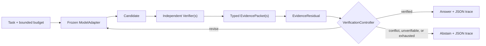

# VerifAxis

> A verification axis for frozen LLMs: think, test, falsify, revise, or abstain.

Language models can revise an answer repeatedly without learning whether it is correct. VerifAxis puts an unchanged model in a bounded loop with independent, executable verifiers. Evidence is typed and auditable; unresolved or conflicting evidence leads to abstention rather than a confident guess.

VerifAxis is an exploratory research runtime and benchmark. It is not a truth machine and does not eliminate hallucinations.

## Offline smoke demo

Requires Python 3.11+. Install locally with `python -m pip install .`, then run this five-line example:

```python
from verifaxis import verify
from verifaxis.models import ReplayModel
from verifaxis.verifiers import SafeMathVerifier

result = verify("What is 197 * 83?", ReplayModel(), [SafeMathVerifier()], 4)
print(result.answer, result.status.value)
```

Expected deterministic output:

```text
16351 VERIFIED
```

No API key, network, GPU, or paid call is needed.

## Before and after

`ReplayModel` deliberately gets the first attempt wrong. The math verifier parses only a strict arithmetic AST, reports the violated equality and expected value, and the model revises only after receiving that independent evidence:

```console
$ verifaxis demo
{
  "final_answer": "16351",
  "initial_answer": "16352",
  "iterations": 2,
  "label": "smoke/demo",
  "model_calls": 2,
  "status": "VERIFIED",
  "task": "What is 197 * 83?",
  "verifier_calls": 2
}
```

This is `smoke/demo` output, not a benchmark result.

## Architecture

VerifAxis implements **Verifier-Conditioned External Recurrence (VCER)**:



The loop persists candidates, concise structured state, evidence hashes, residuals, budgets, and termination decisions. It neither requests nor stores private chain-of-thought. LLM-generated criticism is always marked as LLM-produced and never silently treated as independent evidence.

The black-box adapter supports OpenAI-compatible HTTP endpoints, including compatible local servers. The CLI accepts a JSON model object with `type`, `model`, `base_url`, and optional `api_key_env`; endpoint usage is normalized in the trace. Open-weight latent recurrence is an interface-level future direction only; v0.1 makes no claim that it works.

## What VerifAxis does not guarantee

- A passing verifier proves only the checked property within that verifier's scope.
- Bugs, missing constraints, stale state, or compromised verifiers can still produce wrong outcomes.
- Retrieved text is not automatically true or independent evidence.
- More iterations can regress correct answers; the benchmark measures that transition explicitly.
- Arbitrary model-generated Python is never executed by the default verifiers.

See the [threat model](docs/threat-model.md) and [novelty decision](docs/novelty-decision.md).

## CLI and reproduction

```bash
verifaxis demo
verifaxis run examples/arithmetic.json
verifaxis bench --config configs/smoke.json
verifaxis report runs/latest --format html
```

Run all offline checks:

```bash
python -m pip install -e ".[dev]"
ruff format --check .
ruff check .
mypy src
pytest
python -m build
```

The canonical smoke config runs seven implemented shared-trajectory policies:
direct, no-feedback, verify-once/repair-once, fixed external feedback,
accepted-first, verifier-best-trajectory, and VCER. One initial candidate is
cached across conditions, fault schedules exclude policy identifiers, and the
primary feedback representation is status-only. VRR-Guard and VRR-Stop are
required research comparators but are explicitly unavailable, so headline
experiments remain **BLOCKED**. See [reproducing](docs/reproducing.md), the
[benchmark card](docs/benchmark-card.md), and the [draft v0.2 contract](docs/research-contract-v0.2-draft.md).

For an OpenAI-compatible local or remote endpoint, use a JSON run config:

```json
{
  "task": "What is 197 * 83?",
  "model": {
    "type": "openai_compatible",
    "model": "pinned-model-id",
    "base_url": "http://127.0.0.1:8000/v1",
    "api_key_env": "VERIFAXIS_API_KEY"
  },
  "verifiers": ["safe_math"],
  "max_iterations": 4,
  "max_total_tokens": 4096
}
```

No real endpoint is called by the offline demo or smoke benchmark.

## Add a verifier

Implement the `Verifier` protocol and return an `EvidencePacket` for every applicable check. A verifier must document its version, checked claim, provenance, independence class, reliability assumptions, raw artifact policy, and whether any field came from an LLM. Counterexamples should be machine-readable when possible.

```python
class MyVerifier:
    verifier_type = "my-verifier"
    verifier_version = "1"

    def verify(self, *, task, candidate): ...
```

Start with `src/verifaxis/verifiers/` and the security boundaries in [CONTRIBUTING.md](CONTRIBUTING.md).

## Research status

The Phase-0 audit produced a **PIVOT**. External tool-conditioned correction,
recurrence, counterexample-guided iteration, noisy verify-repair stopping, and
matched misleading/no-feedback evaluation all have direct prior art. The
defensible contribution is an auditable runtime and empirical protocol, not a
new recurrence or stopping principle. Read the [prior-art audit](docs/prior-art.md)
and frozen [research contract](docs/research-contract.md) before interpreting
results.

## License and citation

Apache-2.0. Public author credit: Ali. See [CITATION.cff](CITATION.cff).
