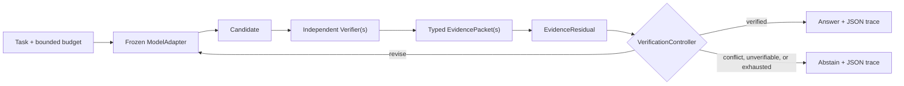

# VerifAxis

> A verification axis for frozen LLMs: think, test, falsify, revise, or abstain.

Language models can revise an answer repeatedly without learning whether it is correct. VerifAxis puts an unchanged model in a bounded loop with independent, executable verifiers. Evidence is typed and auditable; unresolved or conflicting evidence leads to abstention rather than a confident guess.

VerifAxis is an exploratory research runtime and benchmark. It is not a truth machine and does not eliminate hallucinations.

## Quick start

Requires Python 3.11+. Install locally with `python -m pip install .`, then run this five-line example:

```python
from verifaxis import verify
from verifaxis.models import ReplayModel
from verifaxis.verifiers import SafeMathVerifier

result = verify("What is 197 * 83?", ReplayModel(), [SafeMathVerifier()], 4)
print(result.answer, result.status.value)
```

Expected deterministic output:

```text
16351 VERIFIED
```

No API key, network, GPU, or paid call is needed.

## Before and after

`ReplayModel` deliberately gets the first attempt wrong. The math verifier parses only a strict arithmetic AST, reports the violated equality and expected value, and the model revises only after receiving that independent evidence:

```console
$ verifaxis demo
{
  "final_answer": "16351",
  "initial_answer": "16352",
  "iterations": 2,
  "label": "smoke/demo",
  "model_calls": 2,
  "status": "VERIFIED",
  "task": "What is 197 * 83?",
  "verifier_calls": 2
}
```

This is `smoke/demo` output, not a benchmark result.

Persist the complete claim, evidence chain, and named stopping decision, then validate it offline:

```console
$ verifaxis demo --evidence-output demo-evidence.json
$ verifaxis verify-evidence demo-evidence.json
{
  "decision": "VERIFIED",
  "evidence_packets": 2,
  "status": "EVIDENCE ARTIFACT VERIFIED"
}
```

The artifact contains the final explicit claim, both the failing and passing verifier packets,
candidate and packet hashes, the full recurrence trace, `VERIFIED` stopping reason, package
attribution, and limitations. Its outer hash detects accidental or unrecomputed changes; packet
hashes and derived summaries are checked separately. This is self-consistency, not authentication:
an editor can recompute the unsigned hash, and hash validity does not make a verifier correct or
complete. The CLI accepts an identical existing artifact but refuses to overwrite different
content.

## Architecture

VerifAxis implements **Verifier-Conditioned External Recurrence (VCER)**:



The loop persists candidates, concise structured state, evidence hashes, residuals, budgets, and termination decisions. It neither requests nor stores private chain-of-thought. LLM-generated criticism is always marked as LLM-produced and never silently treated as independent evidence.

The black-box adapter supports OpenAI-compatible HTTP endpoints, including compatible local servers. Use HTTPS whenever a remote endpoint receives an API key; plain HTTP can expose the Bearer credential in transit. Open-weight latent recurrence is an interface-level future direction only; v0.1 makes no claim that it works.

## What VerifAxis does not guarantee

- A passing verifier proves only the checked property within that verifier's scope.
- Bugs, missing constraints, stale state, or compromised verifiers can still produce wrong outcomes.
- Retrieved text is not automatically true or independent evidence.
- More iterations can regress correct answers; the benchmark measures that transition explicitly.
- Arbitrary model-generated Python is never executed by the default verifiers.

See the [threat model](docs/threat-model.md) and [novelty decision](docs/novelty-decision.md).

## CLI and reproduction

```bash
verifaxis demo
verifaxis run examples/arithmetic.yaml --evidence-output claim-evidence.json
verifaxis verify-evidence claim-evidence.json
verifaxis bench --config configs/smoke.yaml
verifaxis report runs/latest --format html
```

Evidence output is complete by design: it contains the task, candidates, verifier packets,
counterexamples, and timestamps. Choose a sanitized input or protect the destination as sensitive
data. Output is no-clobber; because timestamps make a fresh run different, use a new filename (or
deliberately remove the old local artifact) when repeating a demo. Validate only artifacts from
trusted-sized inputs: `verify-evidence` checks structure and hashes but does not impose a file-size
or nesting-depth limit.

Run all offline checks:

```bash
python -m pip install -e ".[dev]"
ruff format --check .
ruff check .
mypy src
pytest
python -m build
```

The smoke benchmark runs direct, intrinsic Self-Refine, Best-of-N, a fixed external-feedback loop, random stopping, residual-aware VCER, a tool-augmented initial-answer baseline, and an oracle allocation upper bound. Budgets and tool access are reported rather than hidden. See [reproducing](docs/reproducing.md) and the [benchmark card](docs/benchmark-card.md).

## Add a verifier

Implement the `Verifier` protocol and return an `EvidencePacket` for every applicable check. A verifier must document its version, checked claim, provenance, independence class, reliability assumptions, raw artifact policy, and whether any field came from an LLM. Counterexamples should be machine-readable when possible.

```python
class MyVerifier:
    name = "my-verifier"
    version = "1"

    def verify(self, *, task, candidate): ...
```

Start with `src/verifaxis/verifiers/` and the security boundaries in [CONTRIBUTING.md](CONTRIBUTING.md).
Report a sanitized defect with the [bug form](https://github.com/aliengineering-byte/verifaxis/issues/new?template=bug.yml), or discuss a verifier/research question with the [research form](https://github.com/aliengineering-byte/verifaxis/issues/new?template=research.yml). Never attach private prompts, credentials, or unredacted evidence.

## Research status

The Phase-0 audit produced a **PIVOT**. External tool-conditioned correction, recurrence, adaptive stopping, and counterexample-guided iteration all have direct prior art. The defensible contribution is a model-agnostic runtime and benchmark for typed evidence, correction/regression dynamics, matched accounting, safe stopping, and verifier-fault experiments. Read the [prior-art audit](docs/prior-art.md) and frozen [research contract](docs/research-contract.md) before interpreting results.

## License and citation

Apache-2.0. Public author credit: Ali. See [CITATION.cff](CITATION.cff).
