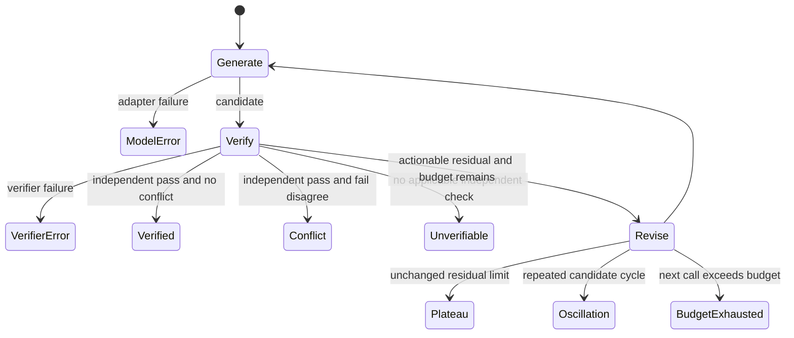

# Architecture

## Boundary

VerifAxis is a model-agnostic runtime around an unchanged model. The technical term is **Verifier-Conditioned External Recurrence (VCER)**. “Third axis” is only a motivating metaphor; ordinary Transformer neurons are not described as two-dimensional.

For task `x` and recurrence step `z`:

```text
h_z     = B_theta(x, p_z)
e_z     = V(y_z, environment)
p_{z+1} = A_phi(p_z, h_z, Encode(e_z))
```

`B_theta` is frozen, `V` is an independently characterized verifier, and v0.1's `A_phi` is a transparent rule-based controller.

## Protocols

| Protocol | Responsibility | Trust boundary |
|---|---|---|
| `ModelAdapter` | Produce a candidate from task, compact state, and budget | Output is untrusted; no private chain-of-thought required |
| `Verifier` | Check a specific claim and emit typed evidence | Must declare independence, provenance, reliability, and LLM-origin fields |
| `EvidencePacket` | Immutable check status, counterexample, metadata, hash, artifact reference | Hash protects trace integrity, not verifier truth |
| `EvidenceResidual` | Explicit unresolved/failed/conflicting constraints | Data, not free-form hidden reasoning |
| `VerificationController` | Continue, verify, abstain, or stop on a named failure mode | Cannot promote LLM criticism to independent proof |
| `RunTrace` | Persist steps, accounting, evidence, residuals, termination | JSON-safe and auditable |

Provider, verifier, controller, trace storage, and reporting boundaries remain separate so experiments can change one factor at a time.

## State machine



Pass/fail status from an LLM-generated component may be recorded, but cannot independently cause `VERIFIED`.

## Operating modes

### Black-box text recurrence (v0.1)

The model receives the task, previous candidate, failed constraints, machine counterexamples, unresolved residual, and remaining budget. `OpenAICompatibleModel` uses an explicitly configured endpoint. `ReplayModel` is the offline deterministic fixture.

### Open-weight latent recurrence (future)

The protocol allows a later frozen Hugging Face base plus a small trainable state/soft-prompt adapter. No such backend is claimed to work in v0.1. Huginn, T²MLR, Retrofitted Recurrence, Coconut, Ouro, and ANIRA are prior art and baselines.

## Data and privacy

Traces contain concise candidate text, evidence, decisions, and accounting. They do not require hidden activations or private chain-of-thought. Endpoint users remain responsible for provider retention policies and sensitive prompt handling.
